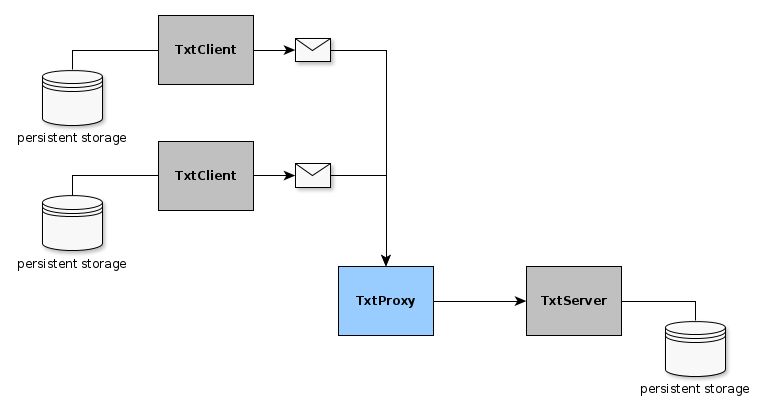

# The problem

Client sends messages to server via unreliable connection.
Server must save each message in database.

# Solution

Common approach to solve this kind of problems is database synchronization from client to server.

Each message gets UUID on creation. 

Client generates message and saves it in local database. The message has delivered status which is false on creation. The client periodically sends batches of undelivered message to the server via http post request, and if reply is ok updates the messages delivered status to true.

Server listens on http endpoint for incoming messages. Upon request it saves the message in database if it does not exists there, and replies with 200 status.



# Implementation

Docker containers used to emulate client-server communication with losses.

* server

* client (several)

* toxiproxy for simulation of connection problems

* toxiproxy configurator


## Storage

SQLite database is used


## Run

Required:
    - jdk
    - maven
    - docker
    - docker-compose

```
cd TextSaver
mvn package
cd ..
docker-compose up --scale textclient=[number of clients]
```